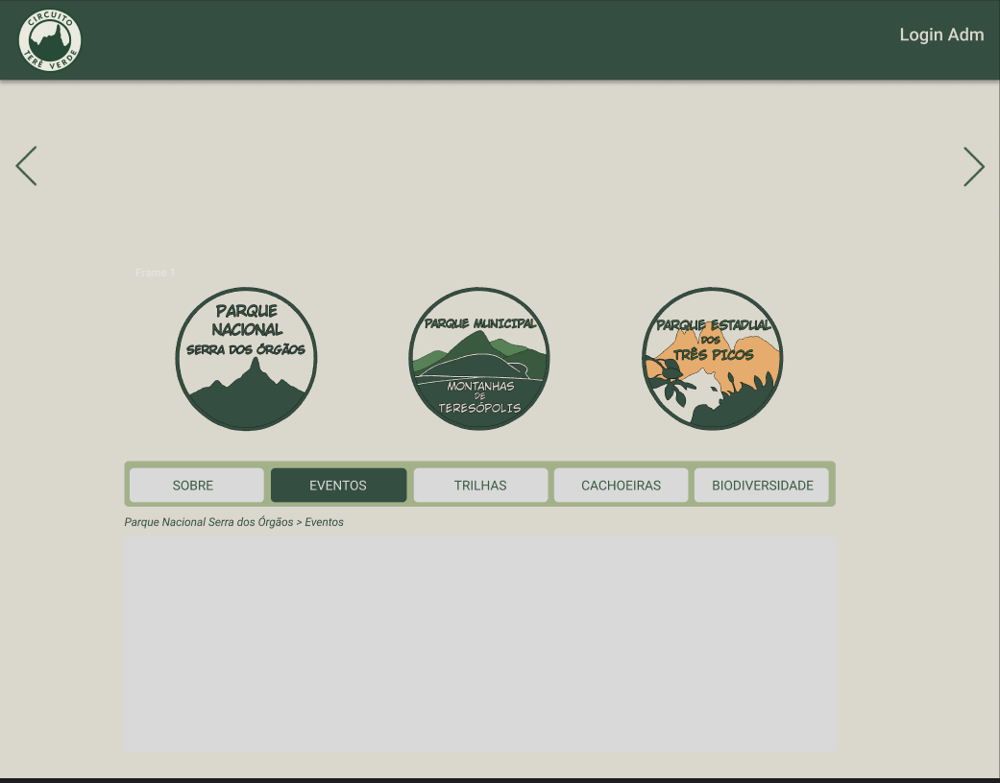
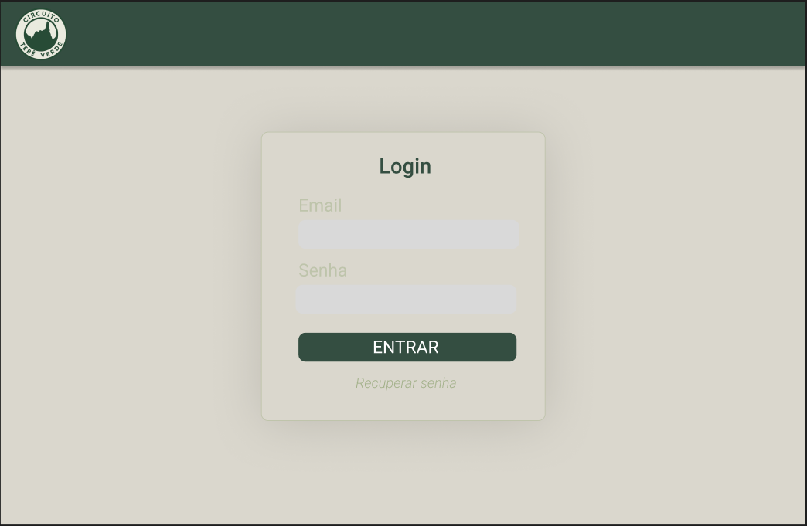

# Grupo 2
Rafael Mendes, Igor Augusto, Nauan Pereira, Ingrid Mendes

# Situação Problema: 
Dificuldade em acessar informações sobre o Parque Nacional da Serra dos Órgãos, o Parque Estadual dos Três Picos e o Parque Natural Municipal Montanhas de Teresópolis, como informações sobre suas trilhas, cachoeiras e biodiversidade.

Apresentamos o  **Circuito Terê Verde**, um projeto desenvolvido para promover o ecoturismo e tornar mais simples a descoberta das belezas naturais, reunindo em uma única plataforma dados sobre trilhas, cachoeiras, atividades de ecoturismo e a conscientização ambiental na região.

## Índice
- [O Desafio](#O-Desafio)
- [MVP](#MVP)
- [Funcionalidades principais](#funcionalidades-principais)
- [Atores Envolvidos](#Atores-Envolvidos)
- [Público Alvo](#público-alvo)
- [Dores do público alvo](#dores-do-público-alvo)
- [Benefícios](#Benefícios)


## O Desafio
Desenvolver uma solução digital que centralize informações sobre as unidades de conservação de Teresópolis, permitindo que turistas e visitantes planejem suas visitas de forma eficiente, consciente e segura, valorizando o ecoturismo e a preservação ambiental.

## MVP
O MVP do Circuito Terê Verde consiste em uma plataforma digital mínima e funcional que centraliza informações essenciais sobre as atrações naturais de Teresópolis, focando nas trilhas, cachoeiras e biodiversidade das unidades de conservação. Seu objetivo é orientar turistas e moradores locais de forma prática e consciente, oferecendo dados atualizados em uma interface moderna e de fácil acesso.

## Funcionalidades principais:
- *Página de Informações sobre Parques*: Apresenta dados sobre trilhas, cachoeiras, biodivercidade, eventos, novidades e atrações. Tudo em um só lugar facilitando a busca.
- *Publicação de postagens*: Administradores poderão criar e divulgar diferentes tipos de conteúdo relacionados aos parques.
- *Interface responsiva e intuitiva*: Design simples para acesso via celular e computador.

## Atores Envolvidos:
- *Visitantes*: Turistas e moradores que buscam informações sobre trilhas, biodiversidade e eventos.
- *Administradores*: Responsáveis por manter o site atualizado.

## Público-alvo: 
  - *visitantes*: Turistas e moradores interessados em ecoturismo, trilhas e atividades de montanhismo em Teresópolis.

## Dores do público alvo:
- *Informações dispersas*: Visitantes encontram dificuldade em localizar informações sobre os parques.
- *Planejamento de visitas*: Sem um calendário centralizado, turistas podem perder eventos ou horários de visitação ideais.
- *Acesso limitado a dados*: Dados sobre trilhas, fauna e flora nem sempre estão disponíveis de forma confiável.

## Benefícios:
- *Planejamento eficiente de visitas*: Turistas podem se organizar de forma prática.
- *Informações atualizadas*: Administradores podem atualizar conteúdos em tempo real.
- *Promoção do ecoturismo*: Divulgação de atrações naturais de forma sustentável.
- *Acesso remoto e conveniente*: Plataforma disponível em múltiplos dispositivos.


## Protótipos

Para entender melhor a interface do sistema, fizemos algumas prototipagens. Abaixo estão as imagens das prototipagens em JPEG/PNG.
Foi utilizado o Figma para realizar os protótipos:

🔗 [Link do Protótipo no Figma](colocar aqui o link do figma)




## Lista de Requisitos

Os requisitos funcionais e não funcionais deste projeto estão organizados em uma planilha para facilitar a visualização e o gerenciamento.

🔗 [Clique aqui para acessar a planilha de requisitos](https://docs.google.com/spreadsheets/d/17M4lhHh-zplAb1LycOdzhCNI1cL9nvuHoTDNzm8jUvw/edit?usp=sharing)
- [Baixar Planilha](https://raw.githubusercontent.com/Rarzox-Software/Circuito_Tere_Verde/main/requisitos/Circuito%20Tere%20Verde%20Requisitos.xlsx)

## Slide de Apresentação
Você pode visualizar os slides de apresentação do MVP no link abaixo:

[Slides de Apresentação](https://gtiunifeso-my.sharepoint.com/:p:/g/personal/nauanlima_unifeso_com_vc/IQBJe6kAHZOgTawivyfIlXn0AfEWFrAa0uvdk4LgmooNpIY?e=fCOpgB)

## Tecnologias Utilizadas

- **HTML5**: Estruturação do conteúdo do site.
- **CSS3**: Estilização da interface do usuário com foco em responsividade e usabilidade.
- **JavaScript Vanilla**: Implementação de interatividade nas páginas.

## Instalação e Uso

1. Clone o repositório:
   ```bash
   git clone https://github.com/AmandaLisboa-Ramos/Agendamento_NAFESO.git

2. Abra o arquivo index.html no navegador para acessar a página de login.
3. Clique no link para ir para a página de cadastro.
4. Preencha os campos e conclua o cadastro para ser redirecionado ao login.

## Melhorias Futuras
- Integração com um banco de dados para salvar usuários e agendamentos.
- Possibilidade de Cadastrar mais parques e atrações.
- Feedback visual mais interativo para validações.
- Agendamento para Camping.


​


